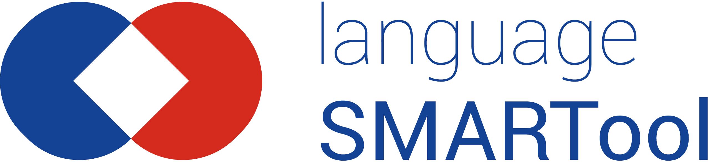

# SMARTool template

## How to create a page for a new language pair

- Create a new repository using https://github.com/smartool/smartool-template/generate
- Adjust these lines: https://github.com/smartool/smartool-template/blob/gh-pages/index.html#L299-L320
- Get an API code from https://app.responsivevoice.org and adjust https://github.com/smartool/smartool-template/blob/gh-pages/index.html#L17

## Dependencies and terms of use

- **Commercial use is not allowed**. Uses
  [ResponsiveVoice Text To Speech](https://responsivevoice.org)
  under a [non-commercial license](https://creativecommons.org/licenses/by-nc-nd/4.0/).
  
- The code (JS and HTML) is licensed under the
  [GNU Affero General Public License](https://www.gnu.org/licenses/agpl-3.0.en.html)
  (except PapaParse which uses MIT license).
- Uses https://www.papaparse.com/#remote-files to fetch [CSV data](https://github.com/smartool/data-rus-eng).

## About

This is a template to create sites like
https://github.com/smartool/smartool-rus-eng.  Please see
https://github.com/smartool/smartool-rus-eng for more information about the
project and the people behind this project.
